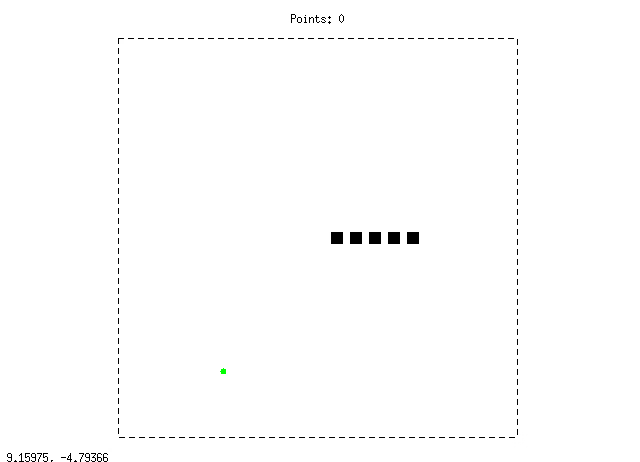

# GnuplotSnake
Classic game Snake implemented using gnuplot.

## Preview

## About project

The goal of this project is to write an implementation of classic game Snake using only syntax, which is avaliable in gnuplot (shell escape commands like `'<...'` or `system()` are not allowed.

Controls: arrows

Tested on: Ubuntu 18.04, gnuplot 5.2

## TODO

* Periodic/open boundary condition switcher;
* Smarter way of food respawning;
* Bonus time-food to add;
